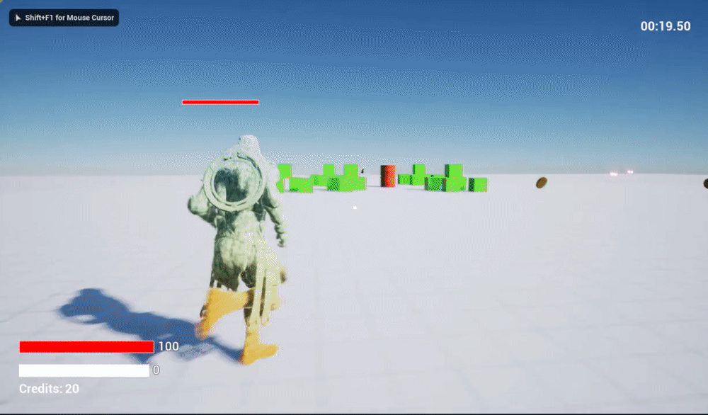

# Action Roguelike (C++ Focused Project in Unreal)

Action Roguelike is a C++ focused (limited use of Blueprints) Unreal Engine project I developed during Tom Looman's [professional game development in C++ and Unreal Engine course](https://courses.tomlooman.com/p/unrealengine-cpp). This course was taught at Stanford in 2020 and is an intense, in-depth project course that dives deep into developing games professionally in C++, with Unreal Engine as the underlying engine.&#x20;

This project is a mix of code I wrote myself during assignments as well as course-provided code. During the course I paid special attention to ensuring I gained a deep understanding of every line of code provided by the class, and in many cases re-wrote course-provided code to be up to my own standards. With that said, please see the page [assignments-c++.md](c++-course/assignments-c++.md "mention") for an overview of the specific parts of the project I developed entirely on my own.

