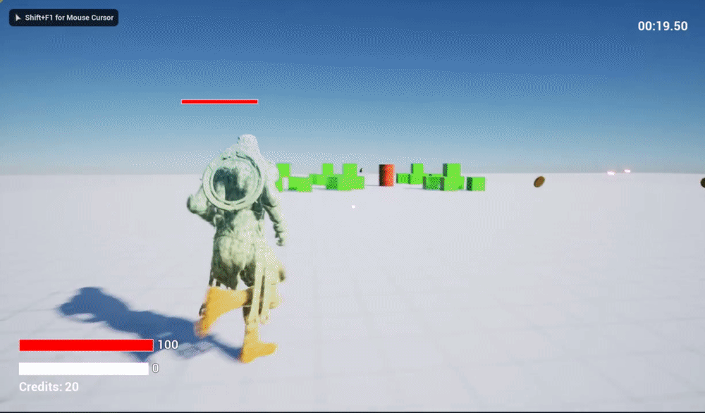

# Action Roguelike (C++ Project in Unreal)

Action Roguelike is a C++ focused (limited use of Blueprints) Unreal Engine project I developed during Tom Looman's [professional game development in C++ and Unreal Engine course](https://courses.tomlooman.com/p/unrealengine-cpp). This course was taught at Stanford in 2020 (and now available online to anyone) and is an intense, in-depth project-based course that dives deep into developing games professionally in C++, with Unreal Engine as the underlying engine.

This project works with a broad range of Unreal's underlying systems in C++ and also develops new frameworks, interfaces, and gameplay mechanics in C++ from scratch. This section of my site is dedicated to explaining the project and its core components in detail.

See it on GitHub: [ActionRogueLike (github.com) ](https://github.com/Juwce/ActionRoguelike)

### Core Project Components (C++)

This project implements and extends a variety of core gameplay systems in C++, including:

| ****[**Networked multiplayer**](../../projects/action-roguelike-c++-project-in-unreal/core-project-components-c++/networked-multiplayer.md)**** | **Debugging Tools** (asserts, logging, breakpoints)                                                                                                   | **Async asset loading & soft references** |
| ----------------------------------------------------------------------------------------------------------------------------------------------- | ----------------------------------------------------------------------------------------------------------------------------------------------------- | ----------------------------------------- |
| [**AI (Behavior Trees)**](../../projects/action-roguelike-c++-project-in-unreal/core-project-components-c++/minion-ai-behavior-trees.md)****    | **Gameplay framework** (character, pawn, actor, game mode, player state, etc.)                                                                        | **Saving and loading player progression** |
| **Event-driven**                                                                                                                                | ****[**Projectiles & Targeting**](../../projects/action-roguelike-c++-project-in-unreal/core-project-components-c++/projectiles-and-targeting.md)**** | **World Interaction**                     |

Please note that this project is a mix of code I wrote myself during assignments as well as course-provided code. While the hardest bits were left up to the assignments, not all of the code contained in the project is my own. Please see the page [assignments-c++.md](c++-course/assignments-c++.md "mention") for an overview of the specific parts of the project I developed entirely on my own. _However_, I should note that during the course I paid special attention to ensuring I gained a deep understanding of _every_ line of code provided by the class. I took this course for my own learning and with an intense curiosity to learn everything I could about developing games professionally in C++. In many cases I have re-written course-provided code to be up to my own standards.


[c++-course](c++-course/)



[core-project-components-c++](core-project-components-c++/)

