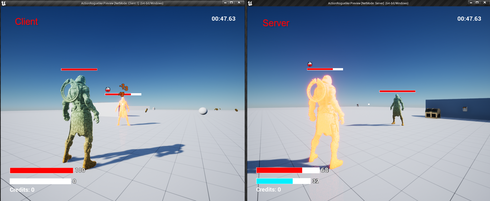

# Projectiles

## Projectile Targeting


Note that in order to keep the snippets within the line character limit, the code snippets below are intentionally written without worrying about const correctness.


The player's projectiles fire from the character's hand towards the nearest target under the player's reticle. Calculating the projectile's spawn parameters takes some simple 3D math, described below.



To aim the projectile in this way, we spawn the projectile at the character's hand, facing in the direction of the target.

The `SpawnLocation` is easy to get, since our Character model is set up with a hand socket. We can retrieve the hand location simply by calling `GetSocketLocation()` on the Character mesh with the name of the hand socket.

`ProjectileRotation` is harder to calculate, and will take some work:

#### Calculating the Projectile Rotation

We need to calculate the world space rotation needed to "look at" the target (such that when the projectile moves forward, it is moving directly towards the target). Luckily, Unreal provides a convenient way to get this world space rotation, provided a vector pointing in the direction you want to look at:

`FRotationMatrix::MakeFromX(FVector XAxis).Rotator()`

First, this creates a rotation matrix from an X-Axis, then creates a rotator representation of this matrix. All that's left is to calculate the X-Axis that looks from the hand location, in the direction of the target. We can easily compute that by subtracting the two locations, giving us the final result:&#x20;

`FRotationMatrix::MakeFromX(TargetLocation - HandLocation).Rotator();`

But wait! Something is still missing! We know how to generate the rotation, but still need to calculate the target location...

#### Calculating the Projectile Target

To find this target, we perform a line trace from the player's camera into the world where the player is looking:

```cpp
FVector TraceStart = CameraComp->GetComponentLocation();
FVector ControlRotation = Character->GetControlRotation().Vector();
FVector TraceEnd = TraceStart + (ControlRotation * MaxAttackTraceDistance)
```

We then configure the line trace to only collide with objects we consider attack targets:

```cpp
FCollisionObjectQueryParams ObjectQueryParams;
ObjectQueryParams.AddObjectTypesToQuery(ECollisionChannel::ECC_WorldDynamic);
ObjectQueryParams.AddObjectTypesToQuery(ECollisionChannel::ECC_WorldStatic);
ObjectQueryParams.AddObjectTypesToQuery(ECollisionChannel::ECC_Pawn);
	
FCollisionQueryParams CollisionQueryParams;
CollisionQueryParams.AddIgnoredActor(Character);
```

Then we perform the trace, setting the target to the first object hit, or the trace end if nothing was found (e.g. the player was aiming into the sky).

```cpp
FHitResult Hit;
bool bBlockingHit = GetWorld()->LineTraceSingleByObjectType(
	Hit, CameraLocation, TraceEnd, ObjectQueryParams, CollisionQueryParams);

FVector ProjectileTargetLocation = bBlockingHit ? Hit.Location : TraceEnd;
```

### Final Solution



## Projectile Classes

### Projectile Base Class

A projectile base class `TProjectileBase` handles the basic setup of a projectile.

* Can collide with the environment, exploding upon impact
* Provides the following virtual functions:
  * `OnActorHit()` - callback when projectile hits the environment (blocking collision)
  * `Explode()` - play cosmetic effects and destroy self. Triggered by `OnActorHit()` by default
* Contains the basic components shared by all projectiles:
  * `USphereComponent` - Sphere primitive used for collision detection
  * `UProjectileMovementComponent` - Handle velocity, acceleration, direction, etc.
  * `UParticleSystemComponent` - Projectile and explosion VFX
  * `UAudioComponent` - Projectile and explosion sounds

**See it on GitHub:** [TProjectileBase.cpp](https://github.com/Juwce/ActionRoguelike/blob/main/Source/ActionRoguelike/Private/TProjectileBase.cpp) // [TProjectileBase.h](https://github.com/Juwce/ActionRoguelike/blob/main/Source/ActionRoguelike/Public/TProjectileBase.h)

### Magic Projectile

Magic projectiles are the most basic attack a player can perform, dealing damage, applying debuffs, and more. They extend the projectile base class with the following functionality:

Gameplay:

* Deals damage on impact
* Can apply buffs/debuffs on impact
* Can be parried / reflected

Cosmetic:

* Applies camera shake around impact point

**See it on GitHub:** [TProjectile\_Magic.cpp](https://github.com/Juwce/ActionRoguelike/blob/main/Source/ActionRoguelike/Private/TProjectile\_Magic.cpp) // [TProjectile\_Magic.h](https://github.com/Juwce/ActionRoguelike/blob/main/Source/ActionRoguelike/Private/TProjectile\_Magic.h)

### Dash Projectile

Dash projectiles fly forward, exploding on impact or after a set duration expires. Upon exploding, there is a short delay before the player is teleported to the explosion's impact point. They extend the projectile base class with the following functionality:

Gameplay:

* Teleports player to projectile location on impact, or after a set duration expires

**See it on GitHub:** [TProjectileBase.cpp](https://github.com/Juwce/ActionRoguelike/blob/main/Source/ActionRoguelike/Private/TProjectileBase.cpp) // [TProjectileBase.h](https://github.com/Juwce/ActionRoguelike/blob/main/Source/ActionRoguelike/Public/TProjectileBase.h)
