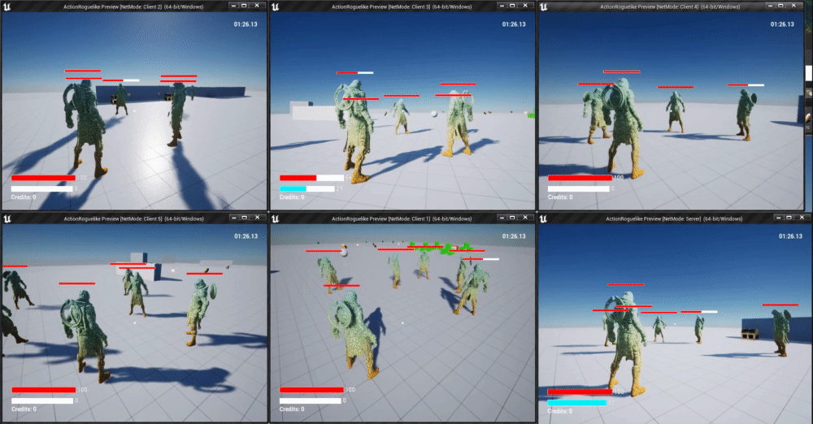

# Networked Multiplayer



Every aspect of this project also works in networked multiplayer for any number of players!

* Actions
* Attributes
* Powerups
* Interaction
* World UI Widgets (floating damage text, health bars)
* Actor spawning and movement (built-in from Unreal)
* AI (built-in from Unreal)
* etc.

This project leverages Unreal Engine's C++ [networking framework](https://docs.unrealengine.com/5.0/en-US/networking-and-multiplayer-in-unreal-engine/) for replicating game state, and limits the direct modification of non-cosmetic game state to the server (`HasAuthority()`). Clients wishing to change game state must do so through requests to the server. Care was taken preserve network performance by limiting use of RPCs (remote procedure calls), reliable / tcp network calls, and only replicating the bare minimum amount of data needed for a client/server to update game state in order to preserve network performance.

Instead of covering every detail of this project's networking, the below sections break down one of the most challenging networking implementations in the project, networked actions. Note that this framework comes from [the course](https://courses.tomlooman.com/p/unrealengine-cpp) I took, but the thorough breakdown of how it all works and diagrams below are entirely my own.

### Jump to Section...

* [Networked Action Framework](networked-multiplayer.md#networked-action-framework)
* [Frame-by-Frame Example](networked-multiplayer.md#frame-by-frame-example)

## Networked Action Framework

"Actions" are a part of the Action Framework designed by [Tom Looman](https://github.com/tomlooman/ActionRoguelike). Diagrams, descriptions and examples below are entirely my own.

In this Action framework, any actor assigned an Action Component ([TActionComponent.cpp](https://github.com/Juwce/ActionRoguelike/blob/main/Source/ActionRoguelike/Private/TActionComponent.cpp)) is given access to an array of Action objects ([TAction.cpp](https://github.com/Juwce/ActionRoguelike/blob/main/Source/ActionRoguelike/Private/TAction.cpp)) that define arbitrary logic that can be started, stopped, granted and revoked (e.g. sprinting, attacks, jumping, etc.). The starting, stopping, granting and revoking of actions are replicated across the network, providing a useful way to manage the performing of arbitrary gameplay actions over the network to any number of players: just extend the Action class and put whatever functionality you want replicated in `StartAction()` and `StopAction()` (being mindful of the below network replication behavior).

Actions exhibit the following networked behavior:

1. Only the server can grant or revoke actions.
2. Granted actions are instanced, and these instances are stored in an actor's ActionComponent. Action instances are replicated across the network.
3. Clients can start actions that have been granted by the server. When they do, that action is also started on the server.
4. Whenever the server starts an action, that action is also started on all clients in the session (except the client that initially started the action, if the starting of the action originated from a client).

### Code for Networked Actions


Click on the "Diagram" tab to see a flow-chart walking through how the logic replicates between client and server.




**1.** Only the server can grant or revoke actions:


```cpp
void UTActionComponent::AddAction(
    AActor* Instigator, const TSubclassOf<UTAction> ActionClass)
{
    if (!GetOwner()->HasAuthority)
    {
        UE_LOG(LogTemp, Warning,
            TEXT("Client attempting to AddAction, Actions should only be "
                 "added on the server. [Class: %s]"),
            *GetNameSafe(ActionClass));
	return;
    }
 
    // Create instance of ActionClass and add it to Actions array
    ...   
}
```



**2.** Action instances are replicated across the network:


```cpp
UPROPERTY(Replicated)
TArray<UTAction*> Actions;
```




```cpp
void UTActionComponent::GetLifetimeReplicatedProps(
	TArray< FLifetimeProperty > & OutLifetimeProps ) const
{
    Super::GetLifetimeReplicatedProps(OutLifetimeProps);
    // also mark as UPROPERTY(Replicated) in ActionComponent.h
    DOREPLIFETIME( UTActionComponent, Actions );
}

bool UTActionComponent::ReplicateSubobjects(
	UActorChannel* Channel, FOutBunch* Bunch, FReplicationFlags* RepFlags)
{
    bool WroteSomething = Super::ReplicateSubobjects(Channel, Bunch, RepFlags);
    // Replicate every action that had a change
    for (UTAction* Action: Actions)
    {
        if (Action)
        {
            WroteSomething |= Channel->ReplicateSubobject(
                                            Action, *Bunch, *RepFlags);
        }
    }
    // tells Unreal "there was a change in this component, please replicate my data"
    return WroteSomething;
}
```




.png>)






**3.** Clients can start actions. When they do, that action is also started on the server.


```cpp
bool UTActionComponent::StartActionByName(
    AActor* Instigator, const FName ActionName)
{
    ...
    if (!GetOwner()->HasAuthority()) // is client
    {
        ServerStartAction(Instigator, ActionName);
    }
    ...
}

// Set UFUNCTION(Server, Reliable) in TActionComponent.h
void UTActionComponent::ServerStartAction_Implementation(
    AActor* Instigator, FName ActionName)
{
    StartActionByName(Instigator, ActionName);
}
```




```cpp
UFUNCTION(Server, Reliable)
void ServerStartAction(AActor* Instigator, FName ActionName);
```



**4.** Whenever the server starts an action, that action is also started on all clients in the session (except the client that initially started the action, if the starting of the action originated from a client).


```cpp
struct FActionRepData
{
    GENERATED_BODY()
    
public:	
    UPROPERTY()
    bool bIsRunning;

    UPROPERTY()
    AActor* Instigator;
};

...

UPROPERTY(ReplicatedUsing="OnRep_RepData")
FActionRepData RepData;

UFUNCTION()
void OnRep_RepData();
```




```cpp
void UTAction::GetLifetimeReplicatedProps(TArray<FLifetimeProperty>& OutLifetimeProps) const
{
    Super::GetLifetimeReplicatedProps(OutLifetimeProps);

    // default rule that says to unconditionally replicate the value
    // to all clients when changed
    DOREPLIFETIME(UTAction, RepData);
}

/* 
 * If the action was started from a client, the client will already have
 * the same copy of RepData and will skip this call (rep notifies only
 * trigger on data changes by default).
 */
void UTAction::OnRep_RepData()
{
    if (RepData.bIsRunning)
    {
        StartAction(RepData.Instigator);
    }
    else
    {
        StopAction(RepData.Instigator);
    }
}
```




.png>)




I noticed an issue with this action framework as I was writing this section. The implementation in #4 will cause issues if your action stops on the client before the request has time to make the round trip from client1->server->client1. In this case, `RepNotify()`will trigger, as `RepData.bIsRunning` will be false by the time the request makes its way back around.&#x20;

This implementation needs to be improved by also passing along an instigating client ID in `RepData` that is checked in `OnRep_RepData()` to ensure an action does not get started twice (or recursively) on a client. Note this bug also exists in Tom Looman's [version of the code](https://github.com/tomlooman/ActionRoguelike/blob/master/Source/ActionRoguelike/Private/SAction.cpp). I will try and get around to fixing this in the future, but for now I wanted to leave this warning to any readers implementing the above.


## Frame-by-Frame Example:

This section breaks down the network logic for this networked attack sequence frame-by-frame:


### 1. Client starts an Attack

**Frame**:

 (2).png>)

**What's happening?**

* The client pressed their attack key, starting the character's [attack action](https://github.com/Juwce/ActionRoguelike/blob/main/Source/ActionRoguelike/Private/TAction\_ProjectileAttack.cpp) which in turn runs the cosmetic parts of the attack locally (spell cast animation and particle effects at the hand).
* The client makes a **reliable** RPC (TCP) to the server to also start the attack action.&#x20;
* The server then runs the attack action, playing cosmetic effects and (server only) also setting the timer to spawn the attack projectile.
* The server replicates the attack action's `IsRunning` property, triggering a RepNotify on other clients that would in turn start the same attack action there (not applicable to the frame above as there are only two players).
  * The actual data replicated is a struct containing both `IsRunning` and `InstigatorActor`, this is how client 2 knows which actor should perform the action when it is replicated (actions are also instanced and those instances are replicated across the network, which is another way the action could tell which character to execute on. But in this case the action is set up to trigger on the instigator and not its owner. See the section above on Networked Action Framework for more details).

**Sequence Diagram:**

.png>)

**Code:**

See [TAction\_ProjectileAttack.cpp](https://github.com/Juwce/ActionRoguelike/blob/main/Source/ActionRoguelike/Private/TAction\_ProjectileAttack.cpp) for full solution (extends the [Networked Action Framework](networked-multiplayer.md#networked-action-framework) detailed above).

Effects are played by everyone:

```cpp
InstigatorCharacter->PlayAnimMontage(AttackAnim);
UGameplayStatics::SpawnEmitterAttached(
    SpellCastVFX, 
    InstigatorCharacter->GetMesh(), 
    InstigatorCharacter->GetHandSocketName());
```

But only the server should spawn projectiles (check `HasAuthority()`):

```cpp
if (InstigatorCharacter->HasAuthority())
{
    FTimerDelegate TimerDel;
    TimerDel.BindLambda([=]() { SpawnProjectile(InstigatorCharacter); });
    GetWorld()->GetTimerManager().SetTimer(
        TimerHandle, TimerDel, AttackDelaySeconds, false);
}
```

### 2. Server spawns attack projectile

**Frame:**

.png>)

**What's happening?**

* The server's timer runs out, starting the SpawnProjectile sequence
* The server computes the location to fire the projectile towards (from the player's hand position on the server towards the nearest actor underneath the player's reticle) and then spawns the projectile.
* The projectile is then replicated to both clients (including its direction and movement properties).

**Sequence Diagram:**

.png>)

**Code:**

The projectile is composed of Unreal-provided classes that are pre-configured to replicate. All we have to do is spawn the projectile:

`GetWorld()->SpawnActor(ProjectileClass, SpawnTM, SpawnParams);`

**Latency considerations:**

The attack target is computed based on the player's control rotation (with the way the camera is set up, this is directly under their reticle where they are looking). Especially with a mouse, if the client is looking around quickly their control rotation could vary quite a bit from the server's last recorded control rotation from the player, causing the projectile to fire in a different direction than the client saw on their screen as the animation played. This would require further testing under higher latency conditions to optimize.

### 3. Attack projectile damages and burns an opponent player

**Frame:**

.png>)

**What's happening?**

* The projectile overlaps with another actor on both the server and the client (due to good latency, both projectiles are in sync), playing explosion effects on each.&#x20;
* The server then applies damage to the overlapped actor. That damage is then replicated back to the client, and a **reliable** multicast RPC triggers a health change broadcast, notifying all listeners (UI, etc.).&#x20;
* Listeners on the client play corresponding effects (damage popup text, health bar updates, etc.) and listeners on the server play effects and apply further attribute changes (for example updating rage which increases when damaged \[also networked but not pictured in diagram]).&#x20;
* Finally, the server applies a burning effect to the overlapped actor which is replicated via the Action framework discussed above.

**Sequence Diagram:**


**Code:**

* Everyone [Explode()](https://github.com/Juwce/ActionRoguelike/blob/3743f15a53c88166833e7a5963a299cbf0770597/Source/ActionRoguelike/Private/TProjectile\_Magic.cpp#L82)s, but only the server `HasAuthority()` to apply the damage action effect (in this case a burning effect).
* Dealing damage ([AttributeComponent::ApplyHealthChange()](https://github.com/Juwce/ActionRoguelike/blob/3743f15a53c88166833e7a5963a299cbf0770597/Source/ActionRoguelike/Private/TAttributeComponent.cpp#L108)) and applying effects ([ActionComponent::AddAction()](https://github.com/Juwce/ActionRoguelike/blob/3743f15a53c88166833e7a5963a299cbf0770597/Source/ActionRoguelike/Private/TActionComponent.cpp#L107)) can only be performed by the authority.

**Latency considerations:**

* In this example, all three projectiles are in sync and overlap with the same actor on the client and server. However this may not always be in case if the game states fall out of sync on high latency connections. In these cases, the server would remain the authority on the game state, but the client(s) would see odd visual behavior:
  * Projectile overlaps on client but not server:
    * Client will see explosion effects but damage and burning effect will not be applied
  * Projectile overlaps on server but not client
    * Client will not see an explosion (unless it overlaps or hits something else), but damage and burning effect will be applied
  * Projectile overlaps on both (pictured in frame)
    * Client and server see explosion effects and damage and burning effect are applied.


**Important note** on using asserts() when checking for authority in core game systems:

`ActionComponent::AddAction()`does the smart thing and asserts (`ensure` is a form of assert in Unreal) that clients cannot add actions. This is very helpful a developer will be clearly alerted whenever they try and add an action client-side. `AttributeComponent::ApplyHealthChange()` does not have this safety check, and you can see in the commits linked above that the client does try to change the player's health in `Explode()` without checking `HasAuthority()`, and only further down the execution chain in `ApplyHealthChange()` does this damage actually get prevented. Since this damage is prevented silently (no assert), the developer may would have to check far down the execution chain to see that their client-side call was not actually changing the player's health. Asserting authority in the core systems of your game is a great way to alert yourself and other developers clearly when they are trying to modify values they shouldn't.


<details>

<summary>Networked Attributes</summary>

### Networked Attributes

#### Replicated Properties

* Health
* HealthMax
* Rage
* RageMax

#### Limiting Authority

* Only the server (`HasAuthority()`) should be able to modify player attributes such as health and rage.
* Attribute properties are protected and can only be modified via the `ApplyHealthChange()` and `ApplyRageChange()` functions. These functions check that the caller `HasAuthority()` (is the server).

#### Broadcasting Attribute Change Events

* When an attribute is changed on the server via `ApplyHealthChange()`, the server sends out a `NetMulticast` (calls function on server and all clients) so that clients can respond cosmetically to attribute changes (such as health and rage UI elements), and the server can respond with further gameplay logic (e.g. reflecting damage dealt back to the attacker).
* `NetMulticast` is not the most optimal solution to do this, but it works well and is used sparingly in the code at this point so should not cause performance issues. With more time, I would work on a solution involving replicating structs containing all the requisite data on damage instigator, as well as counters to keep track of if property replication missed a state change, and using `RepNotify` to respond to changes. For example, if the server changed health 10->5->0, but the client only received 10->0 (the change to 5 was lost), the client would not be aware of the health change from 10->5 and would miss playing a hitflash effect for that instance of damage. However, if you instead replicated a struct that counts the number of times that property has been changed in addition to the new property value, the client could miss this change but still receive enough information to play the hitflash effect. For example, the server would change (10,0)->(5,1)->(0,2) and the client would receive (10,0)->(0,2). Since the client saw the counter go from 0->2, it knows that it missed a health change RepNotify and can respond cosmetically accordingly (play an extra hitflash, sound effect, etc.).

</details>

