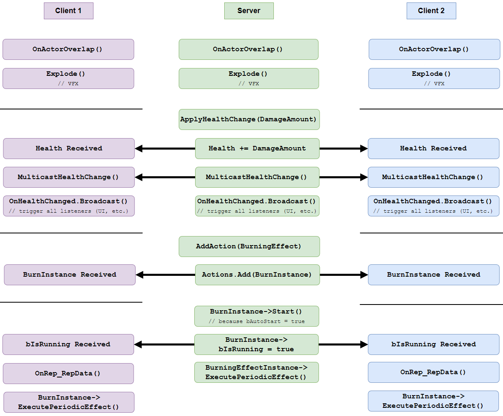

# Networked Multiplayer

Every aspect of this project also works in networked multiplayer (client-server) for any number of players!

* Attributes
* Actions
* Powerups
* Projectiles
* User Interface
* Actor spawning and movement (built-in from Unreal)
* AI (built-in from Unreal)

Leverages Unreal Engine's networking framework for replicating game state, and limits the direct modification of non-cosmetic game state to the server (`HasAuthority()`). Clients wishing to change game state must do so through requests to the server. Care was taken to limit use of RPCs (remote procedure calls) and reliable / tcp network calls and to limit passed data to the bare minimum needed for a client/server to update game state in order to preserve network performance.

### Networked Actions

"Actions" are part of the Action Framework designed by [Tom Looman](https://github.com/tomlooman/ActionRoguelike). Diagrams and examples below are entirely my own.

In this Action framework, any actor assigned an Action Component ([TActionComponent.cpp](https://github.com/Juwce/ActionRoguelike/blob/main/Source/ActionRoguelike/Private/TActionComponent.cpp)) has access to an array of Action objects ([TAction.cpp](https://github.com/Juwce/ActionRoguelike/blob/main/Source/ActionRoguelike/Private/TAction.cpp)) that define arbitrary logic that can be started and stopped. Actions can be granted or revoked to an actor, giving them and taking away functionality at the start of or during gameplay (e.g. sprinting, attacks, jumping, etc.). The actions within an action component, as well as the starting and stopping of actions are replicated across the network, providing a useful way to manage the performing of arbitrary gameplay actions over the network to any number of players.

Actions exhibit the following networked behavior:

1. Only the server can grant or revoke actions.
2. Action instances stored in an actor's ActionComponent are replicated across the network.
3. Clients can start actions, but only if they have been granted that action server.
4. Whenever a client OR server starts an action, that action is started in all other sessions on the network.

### Code for Networked Actions



1\. Only the server can grant or revoke actions:


```cpp
void UTActionComponent::AddAction(
    AActor* Instigator, const TSubclassOf<UTAction> ActionClass)
{
    if (!GetOwner()->HasAuthority)
    {
        UE_LOG(LogTemp, Warning,
            TEXT("Client attempting to AddAction, Actions should only be added"
                 " on the server. [Class: %s]"),
            *GetNameSafe(ActionClass));
	return;
    }
 
    // Create instance of ActionClass and add it to Actions array
    ...   
}
```



2\. Action instances stored in an actor's ActionComponent are replicated across the network.


```cpp
UPROPERTY(Replicated)
TArray<UTAction*> Actions;
```



```cpp
void UTActionComponent::GetLifetimeReplicatedProps(
	TArray< FLifetimeProperty > & OutLifetimeProps ) const
{
    Super::GetLifetimeReplicatedProps(OutLifetimeProps);
    // also mark as UPROPERTY(Replicated) in ActionComponent.h
    DOREPLIFETIME( UTActionComponent, Actions );
}

bool UTActionComponent::ReplicateSubobjects(
	UActorChannel* Channel, FOutBunch* Bunch, FReplicationFlags* RepFlags)
{
    bool WroteSomething = Super::ReplicateSubobjects(Channel, Bunch, RepFlags);
    // Replicate every action that had a change
    for (UTAction* Action: Actions)
    {
        if (Action)
        {
            WroteSomething |= Channel->ReplicateSubobject(
                                            Action, *Bunch, *RepFlags);
        }
    }
    // tells Unreal "there was a change in this component, please replicate my data"
    return WroteSomething;
}
```




.png>)






3\. Anyone can start an action. If an action is started by the client, also start that action on the server:


```cpp
bool UTActionComponent::StartActionByName(
    AActor* Instigator, const FName ActionName)
{
    ...
    if (!GetOwner()->HasAuthority()) // is client
    {
        ServerStartAction(Instigator, ActionName);
    }
    ...
}

// Set UFUNCTION(Server, Reliable) in TActionComponent.h
void UTActionComponent::ServerStartAction_Implementation(
    AActor* Instigator, FName ActionName)
{
    StartActionByName(Instigator, ActionName);
}
```



```cpp
UFUNCTION(Server, Reliable)
void ServerStartAction(AActor* Instigator, FName ActionName);
```



4\. Whenever a client OR server starts an action, that action is started in all other sessions on the network.


```cpp
struct FActionRepData
{
    GENERATED_BODY()
    
public:	
    UPROPERTY()
    bool bIsRunning;

    UPROPERTY()
    AActor* Instigator;
};

...

UPROPERTY(ReplicatedUsing="OnRep_RepData")
FActionRepData RepData;

UFUNCTION()
void OnRep_RepData();
```



```cpp
void UTAction::OnRep_RepData()
{
    if (RepData.bIsRunning)
    {
        StartAction(RepData.Instigator);
    }
    else
    {
        StopAction(RepData.Instigator);
    }
}
```








## Networked Action Example, Frame By Frame


## Frame by Frame:

### 1. Client starts an Attack

 (2).png>)

In this frame we see the client's character starting an attack and the attack replicating to the server (in the form of playing a wind-up animation and spawning particle VFX at the hand).

**Sequence Diagram**

.png>)


****

.png>)

![The magic projectile collides with player on server and client (as this screenshot was taken on a local network, the projectiles locations are almost exactly in sync) and play explosion VFX in response to the collision. Only the server applies the damage and burning effect to the hit actor. However, the damage and burning effect are then replicated back to the client. The server Multicasts the health change, and so the client and server both respond with cosmetic effects (update health bars, show floating damage text, apply hitflash effect, etc.)](<../../../.gitbook/assets/image (5).png>)


### Networked Attributes

#### Replicated Properties

* Health
* HealthMax
* Rage
* RageMax

#### Limiting Authority

* Only the server (`HasAuthority()`) should be able to modify player attributes such as health and rage.
* Attribute properties are protected and can only be modified via the `ApplyHealthChange()` and `ApplyRageChange()` functions. These functions check that the caller `HasAuthority()` (is the server).

#### Broadcasting Attribute Change Events

* When an attribute is changed on the server via `ApplyHealthChange()`, the server sends out a `NetMulticast` (calls function on server and all clients) so that clients can respond cosmetically to attribute changes (such as health and rage UI elements), and the server can respond with further gameplay logic (e.g. reflecting damage dealt back to the attacker).
* `NetMulticast` is not the most optimal solution to do this, but it works well and is used sparingly in the code at this point so should not cause performance issues. With more time, I would work on a solution involving replicating structs containing all the requisite data on damage instigator, as well as counters to keep track of if property replication missed a state change, and using `RepNotify` to respond to changes. For example, if the server changed health 10->5->0, but the client only received 10->0 (the change to 5 was lost), the client would not be aware of the health change from 10->5 and would miss playing a hitflash effect for that instance of damage. However, if you instead replicated a struct that counts the number of times that property has been changed in addition to the new property value, the client could miss this change but still receive enough information to play the hitflash effect. For example, the server would change (10,0)->(5,1)->(0,2) and the client would receive (10,0)->(0,2). Since the client saw the counter go from 0->2, it knows that it missed a health change RepNotify and can respond cosmetically accordingly (play an extra hitflash, sound effect, etc.).
